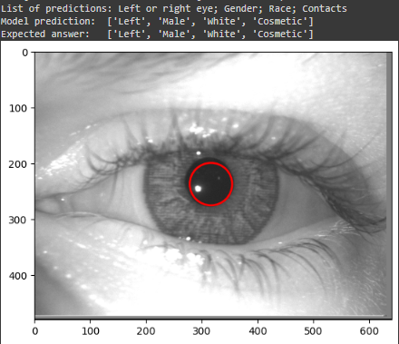

# Contact Lens CNN Classification
## Project abstract

Using the [Notre Dame Contact Lens Dataset](https://cvrl.nd.edu/projects/data/) and the paper "An Efficient Contact Lens Spoofing Classification", this project tries, for learning purposes, replicate the results obtained while exploring more about convolutional neural networks and its particularities.

## Technologies
<ul>
<li>Python 3.11</li>
<li>PyTorch 2.0.1 + cu117</li>
<li>TensorFlow 2.13.0</li>
<li>Google Colab</li>
</ul>

# An overview of the project

This project aims to implement a classification system for items in the Notre Dame Contact Lens Dataset, including labels for various types of lenses used in human eyes. The model also learns additional attributes such as gender, race, the use of cosmetic lenses, and identifies which eye is depicted in the image.

The primary objective of this project is to familiarize myself with Deep Learning concepts and enhance my proficiency in areas such as transfer learning, fine-tuning, loss functions, and more.

Initially, I attempted to develop my model using PyTorch, as I encountered difficulties with TensorFlow. However, midway through the implementation, I opted to return to TensorFlow due to its user-friendly interface, especially considering the complexity of my multi-task learning project with PyTorch. It is important to mention that the model can be found in the foledr 'Pytorch_models'.

For this project, two distinct image datasets were utilized, both sourced from the Notre Dame Contact Lens Dataset. The only code segments employing a different version are 'pupil_localization_model_tensorflow' and 'Lens_and_pupil_identification', both implemented with TensorFlow. This adjustment was necessary because in the original dataset, the position and radius of the pupil were inaccurate.

## Lens_and_pupil_identification results

Implementing the model for identifying various attributes of the eye posed several challenges. These included determining whether the eye is on the left or right side, discerning the gender and race of the individual, as well as ascertaining if the person is wearing contact lenses, particularly for cosmetic purposes. Additionally, pinpointing the center of the pupil and its radius presented its own set of complexities.

After numerous iterations and refinements, I achieved the following notable results:

<ul>
    <li>Eye identification accuracy: 98.50%</li>
    <li>Gender classification accuracy: 81.83%</li>
    <li>Race classification accuracy: 79.33%</li>
    <li>Contact lens detection accuracy: 74.33%</li>
    <li>Pupil position and radius precision: 0.39998</li>
</ul>

Below, you'll find images showcasing predictions made using the validation data:

This code was implemented with tensorflow and can be found on 'Tensorflow_models' folder

